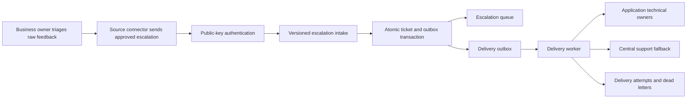

# Support Portal Overhaul Design

**Date:** 2026-08-12
**Status:** Approved design
**Register:** Product, internal operations tool
**Scope:** Central support portal only. Source-application feedback systems are migrated in a later phase.

## 1. Summary

Support Tower will become a reliable second-tier escalation control plane. End-user feedback remains in each source application. A non-technical business owner reviews that raw feedback in the source application and escalates only confirmed bugs or feature requests to the central portal.

The overhaul replaces deployment-managed shared bearer secrets with administrator-approved, public-key enrollment and short-lived access tokens. Accepted escalations and alert jobs are written atomically. A Postgres-backed delivery worker routes alerts to each application's technical owner group, with a central support fallback and durable retries.

The operator interface becomes queue-first. It exposes enrollment state, credential health, routing, delivery attempts, and failures without turning the portal into the system where source-app work is performed.

## 2. Evidence and Current Failure Modes

The repository's existing unit tests, typecheck, and lint pass, but they do not exercise the complete source application to portal to alert journey. The audit found these architectural failures:

1. **Enrollment is circular.** An application appears only after a successful ingest, while ingest already requires a manually configured environment token and a portal redeployment.
2. **Pull-created tickets bypass alerts.** The direct POST route calls `notifyTicketCreated`, while scheduled pull invokes `ingestFeedbackTicket` directly and never dispatches an immediate alert.
3. **Alert failures are invisible.** Pushover failures are logged and swallowed. The ingest request still succeeds, but there is no retry queue, delivery record, or operator-visible failure.
4. **Authentication does not scale operationally.** Each app token is stored in an environment variable. Enrollment and rotation require deployment access and coordinated redeployments.
5. **The UI does not manage the system.** The Source Apps screen presents connector prose but cannot enroll, rotate, revoke, route, or diagnose an application.
6. **The dashboard query is capped at 100 open tickets.** It lacks server-side filtering and keyset pagination for future growth.
7. **Scenario documentation has drifted.** At least one ingest scenario still describes a removed singular token, and the pull scenario describes incremental behavior after the implementation moved to full sync.

## 3. Goals and Capacity

### 3.1 Product goals

- Preserve the two-tier ownership boundary: business triage in each source app, technical escalation in Support Tower.
- Allow an administrator to enroll a source application without deployment-provider access.
- Avoid storing reusable source-app ingest secrets in the portal.
- Rotate or revoke an application credential without downtime for other apps.
- Make every accepted escalation durable and idempotent.
- Make every alert delivery, retry, and terminal failure visible.
- Route alerts to application-specific technical owners with a central fallback.
- Preserve current source-app connectivity during the central migration.
- Provide a polished, accessible product interface for repeated desktop use.

### 3.2 Capacity target

- 100 to 500 new source applications enrolled per year.
- Approximately 500 escalations across the entire portal on a peak launch day.
- Lower sustained traffic after launch periods.
- A verification burst of 500 accepted escalations in a short test window without duplicate tickets or lost delivery jobs.
- On representative deployed infrastructure, authenticated intake targets p95 response latency below two seconds.
- For a healthy configured channel, the first delivery attempt targets p95 start latency below 60 seconds after intake commit.

This traffic does not justify a standalone message broker. Postgres provides sufficient durable queue semantics while keeping the operating model simple.

### 3.3 Non-goals

- Moving first-tier business triage into Support Tower.
- Receiving all raw end-user feedback in Support Tower.
- Replacing the source application's operational ticket dashboard.
- Bidirectional reply sync in this overhaul.
- Bulk escalation ingestion in connector contract version 1.
- Modifying source applications during the central-portal implementation phase.
- Introducing Kafka, RabbitMQ, or a certificate authority for the expected traffic.

## 4. Users and Ownership Model

### 4.1 Business owner

The business owner is a non-technical user of the source application. They review raw feedback and decide whether it is a confirmed bug or a viable feature request. Their workflow remains entirely within the source app.

### 4.2 Technical owner group

Each enrolled app belongs to one technical owner group in Support Tower. The group can contain portal users and channel recipients. It receives alerts for that application's approved escalations according to the app's policy.

### 4.3 Central support group

One portal-wide central group is the fallback. It receives:

- urgent escalations in addition to the app's technical owner group;
- alerts when an app has no valid technical route;
- delivery-health alerts when all app-specific channels fail;
- security alerts for repeated authentication failures or revoked credentials.

### 4.4 Portal roles

- `ADMIN`: enroll apps, manage groups and channels, rotate or revoke credentials, manage portal users, and view the audit trail.
- `SUPPORT`: view and work the technical escalation queue, inspect delivery status, and retry eligible failed deliveries.

## 5. Architecture

Support Tower remains a Next.js App Router modular monolith backed by Postgres and Drizzle. Clear domain modules replace the current coupling between route, persistence, and notification functions.



### 5.1 Modules

| Module | Responsibility |
|---|---|
| App registry | Source-app identity, lifecycle, ownership, environment, and policy linkage |
| Enrollment service | Single-use invitations, exchange validation, and enrollment audit |
| Credential service | Public keys, fingerprints, overlap, rotation, and revocation |
| Service-token issuer | Signed-assertion verification, replay protection, and scoped access tokens |
| Escalation intake | Contract validation, app identity binding, idempotency, normalization, and upsert |
| Delivery engine | Transactional outbox, routing, channel dispatch, retry, and dead-letter handling |
| Operator read models | Queue, application health, delivery health, and audit views |
| Compatibility adapters | Existing bearer ingest and scheduled pull mapped into the new intake command |

### 5.2 Transaction boundary

One database transaction must:

1. claim or create the idempotency receipt;
2. create or update the feedback ticket;
3. determine the immutable alert event for a newly accepted escalation;
4. create one outbox row for each resolved delivery target;
5. finalize the receipt with the portal ticket ID and result.

The API acknowledges only after the transaction commits. Notification-provider availability never participates in this transaction.

## 6. Enrollment and Dynamic Credential Exchange

### 6.1 Invitation creation

An administrator creates the source-app record before enrollment. The record includes:

- stable slug;
- display name;
- environment;
- source business-triage URL, when available;
- technical owner group;
- alert policy.

The portal generates a 256-bit random invitation secret. The UI displays it once as part of a connector configuration package. The database stores only a SHA-256 digest and identifying prefix. The invitation expires after 30 minutes, can be revoked before use, and is invalid immediately after a successful exchange.

### 6.2 Connector key generation

The source connector generates an Ed25519 key pair locally. It sends only its public JWK during invitation exchange. The portal never receives or stores the private key.

### 6.3 Invitation exchange

`POST /api/v1/enrollments/exchange` accepts:

```json
{
  "grant": {
    "id": "grant_01...",
    "secret": "one-time-secret"
  },
  "publicKey": {
    "kty": "OKP",
    "crv": "Ed25519",
    "x": "base64url-public-key"
  },
  "connector": {
    "version": "1.0.0",
    "environment": "production",
    "baseUrl": "https://source.example.com"
  }
}
```

The portal atomically validates and consumes the grant, computes the RFC 7638 JWK thumbprint, creates the active credential, and returns public connection metadata:

```json
{
  "appId": "app_01...",
  "credentialId": "cred_01...",
  "keyId": "jwk-thumbprint",
  "issuer": "https://support.example.com",
  "audience": "support-tower",
  "tokenEndpoint": "https://support.example.com/api/v1/service-tokens",
  "ingestEndpoint": "https://support.example.com/api/v1/escalations"
}
```

The response contains no reusable portal secret.

### 6.4 Short-lived service tokens

The connector signs a client-assertion JWT with its Ed25519 private key. Required claims are:

- `iss` and `sub`: enrolled app ID;
- `aud`: exact service-token endpoint;
- `iat`: current issuance time;
- `exp`: no more than 60 seconds after `iat`;
- `jti`: cryptographically random assertion ID;
- protected header `kid`: registered key ID.

`POST /api/v1/service-tokens` validates the assertion, credential status, time window, audience, and unused `jti`. The portal stores the replay marker until assertion expiry and returns a portal-signed access token:

```json
{
  "accessToken": "short-lived-jwt",
  "tokenType": "Bearer",
  "expiresIn": 300,
  "scope": "escalations:write credentials:rotate"
}
```

Access tokens expire after five minutes. They bind the app ID and credential ID. The intake route derives source-app identity exclusively from the verified token.

### 6.5 Key rotation

`POST /api/v1/credentials/rotate` requires a valid service token and proof from the currently active credential. Rotation is a two-step challenge:

1. register the next public key as `PENDING` and receive a random challenge;
2. confirm the challenge with a signature from the new private key.

Confirmation activates the new key. The old key remains active for a configurable overlap of up to seven days, then expires automatically. An administrator can revoke either key immediately. At least one active key is required unless the app itself is paused or revoked.

## 7. Versioned Escalation Contract

### 7.1 Endpoint

`POST /api/v1/escalations`

Required headers:

- `Authorization: Bearer <short-lived-access-token>`
- `Idempotency-Key: <stable-source-event-id>`
- `Content-Type: application/json`

Maximum decoded request size: 256 KB.

### 7.2 Payload

```json
{
  "schemaVersion": 1,
  "externalId": "FEEDBACK-1842",
  "classification": "BUG",
  "status": "NEW",
  "priority": "HIGH",
  "title": "Cannot confirm a refrigerated delivery",
  "description": "The confirmation action remains disabled after all required fields are present.",
  "sourceUrl": "https://source.example.com/admin/feedback/FEEDBACK-1842",
  "triage": {
    "ownerRef": "business-owner-42",
    "ownerName": "Camille Renard",
    "escalatedAt": "2026-08-12T10:15:00.000Z"
  },
  "reporter": {
    "name": "Élodie Martin",
    "email": "elodie.martin@example.test",
    "sourceId": "reporter-98"
  },
  "browserInfo": "Safari 20 on macOS",
  "markdownSpec": null,
  "transcript": null,
  "remoteCreatedAt": "2026-08-12T09:50:00.000Z",
  "remoteUpdatedAt": "2026-08-12T10:15:00.000Z",
  "metadata": {}
}
```

Allowed classifications are `BUG` and `FEATURE_REQUEST`. Existing `EVOLUTION` records are presented as Feature request and migrated without data loss.

The connector does not submit an app slug or app name as authority. App identity comes from the access token. Display metadata supplied by the connector cannot rename or reassign the registered app.

### 7.3 Idempotency

The unique key is `(source_app_id, idempotency_key)`. The intake stores a canonical request digest.

- Same key and same digest returns the original response.
- Same key and different digest returns `409 IDEMPOTENCY_CONFLICT`.
- Different idempotency keys for the same `(source_app_id, external_id)` update the existing ticket and create delivery work only when the accepted escalation event materially changes according to the notification policy.

### 7.4 Responses

- `201`: new escalation created.
- `200`: existing escalation updated or identical retry replayed.
- `400`: invalid versioned payload.
- `401`: missing, invalid, expired, or revoked token.
- `409`: idempotency conflict.
- `413`: payload too large.
- `429`: rate limit exceeded, including `Retry-After`.
- `503`: durable persistence unavailable. No acceptance is claimed.

Successful response:

```json
{
  "ticketId": "ticket_01...",
  "result": "created",
  "acceptedAt": "2026-08-12T10:15:01.000Z"
}
```

## 8. Data Model

All timestamps use UTC with millisecond precision. Identifiers are non-sequential opaque strings. Every mutable security or routing operation appends an immutable audit event.

| Table | Important fields and constraints |
|---|---|
| `source_apps` | Existing identity fields plus enrollment status, credential mode, technical group ID, last authenticated time, and last ingested time |
| `app_enrollment_grants` | App ID, token digest, prefix, expiry, consumed time, revoked time, creator, and created time |
| `app_credentials` | App ID, public JWK, unique thumbprint, state, valid-from, valid-until, revoked-at, revoker, and rotation parent |
| `service_assertion_replays` | Credential ID, assertion `jti`, expiry, and composite unique constraint |
| `feedback_tickets` | Existing normalized ticket with classification compatibility and business-triage metadata |
| `ingest_receipts` | App ID, idempotency key, canonical digest, ticket ID, result, response snapshot, and unique `(app_id, key)` |
| `support_groups` | Name, central-fallback flag, status, and audit timestamps |
| `support_group_members` | Group ID, portal user ID or channel-recipient identity, role, and status |
| `notification_channels` | Group ID, channel type, encrypted configuration, display metadata, state, last success, and last failure |
| `app_notification_policies` | App ID, per-channel priority threshold, urgent central-copy rule, and fallback behavior |
| `delivery_outbox` | Ticket event ID, target channel, immutable rendered payload, state, next attempt, attempt count, lease fields, and unique event-target key |
| `delivery_attempts` | Outbox ID, ordinal, start/end time, result class, provider status, sanitized error, and provider message ID |
| `audit_events` | Actor type and ID, action, subject type and ID, sanitized metadata, request correlation ID, and immutable creation time |

Channel secrets and webhook signing keys are encrypted with AES-256-GCM using a versioned server-side envelope key. The database stores ciphertext, nonce, authentication tag, and key version. Recipient display names and redacted destinations remain queryable without decrypting configuration.

### 8.1 Required indexes

- Open queue: status, priority, updated time, and ticket ID for keyset pagination.
- App health: app ID plus last ingested time.
- Outbox claiming: state, next-attempt time, and lease expiry for rows in pending or retrying states.
- Delivery history: channel ID plus creation time; ticket ID plus creation time.
- Credential lookup: app ID plus state; unique JWK thumbprint.
- Replay expiry: expiry time for scheduled cleanup.
- Audit: subject type, subject ID, and creation time.

## 9. Notification Routing and Delivery

### 9.1 Routing rules

- Every app has one technical owner group.
- All approved escalations route to that group by default.
- Each channel can define a minimum priority.
- Urgent escalations always route to the app group and central group.
- A missing or unhealthy app route adds the central fallback.
- Duplicate event-target combinations are prevented by a unique constraint.
- Business owners are not portal notification recipients by default because their work ends at escalation.

### 9.2 Initial channel adapters

- Email
- Pushover compatibility
- Generic webhook with timestamped HMAC signature and replay window

Slack and Teams can later consume the generic webhook path or add dedicated adapters without changing intake storage.

### 9.3 Worker semantics

Workers claim eligible rows with a lease using `FOR UPDATE SKIP LOCKED`. A short post-commit wake-up attempts immediate delivery, while a once-per-minute scheduled sweep guarantees recovery if the wake-up is lost.

Provider responses are classified:

- `SENT`: provider accepted the message.
- `RETRYING`: network failure, timeout, rate limit, or retryable provider error.
- `FAILED`: permanent provider error or exhausted retry budget.
- `CANCELLED`: channel, app, or policy disabled before dispatch.

Temporary failures retry with increasing delays and jitter for up to 24 hours. Every attempt is persisted before the row reaches a terminal state. Operators may retry a terminal failure after correcting its channel, producing a new auditable outbox generation rather than rewriting history.

### 9.4 Alert content

Default outbound content contains:

- app name;
- classification;
- priority;
- title;
- authenticated Support Tower link.

Reporter name, email, descriptions, transcripts, and browser details are excluded by default. An administrator can opt a trusted channel into reporter context, and that choice is visible in the policy UI and audit trail.

## 10. Legacy Compatibility

The current endpoints remain available during central migration:

- `POST /api/feedback/ingest`
- scheduled source-app pull;
- per-ticket refresh from source.

Each becomes a compatibility adapter that authenticates by its current mechanism, validates the configured source app, and constructs the same internal `EscalationCommand` used by version 1 intake.

Compatibility rules:

- Pull configuration supplies the authoritative app slug. A returned payload with a different slug is rejected.
- Direct bearer ingest resolves the legacy credential, then binds the resulting command to that registered app.
- Legacy adapters write ingest receipts and outbox rows in the same transaction as new connectors.
- New pull-created tickets therefore create alerts.
- Existing inline Pushover dispatch is removed only after the outbox worker is active.
- The Applications UI labels legacy credentials and reports their last use.
- Legacy authentication is removed only when no app has used it during the agreed migration window.

## 11. Security Model

### 11.1 Controls

- Invitations are high-entropy, single-use, hashed at rest, expiring, and revocable.
- Source private keys never leave source applications.
- Access tokens are short-lived, scoped, audience-bound, and credential-bound.
- Client assertions expire within 60 seconds and use persisted replay protection.
- Token comparisons and secret-digest comparisons are constant-time.
- Enrollment, token, and ingest routes use separate per-IP and per-app rate limits.
- App identity is never accepted from an untrusted payload field.
- App, invitation, credential, user, group, channel, and policy changes are auditable.
- Logs omit credentials, access tokens, invitation secrets, encrypted channel configuration, and reporter details.
- Security errors return stable public codes and correlation IDs without exposing internal state.
- Credential revocation is effective on the next request. Previously issued five-minute tokens may be rejected immediately by checking credential status during intake.

### 11.2 Data minimization

The portal receives only business-approved escalations. It retains existing reporter name and email support because technical investigation can require contact context, but outbound alert content excludes that data by default. Raw payload retention is replaced by a documented, minimized versioned snapshot rather than an unbounded copy of unknown fields.

### 11.3 Rate-limit defaults

- Enrollment exchange: 10 attempts per invitation and 30 attempts per IP per hour.
- Service-token exchange: 60 attempts per credential per minute, with burst allowance.
- Escalation intake: 120 requests per app per minute, with clear `Retry-After` responses.

These limits exceed the expected workload while containing compromised connectors.

## 12. Product Interface

### 12.1 Physical scene and theme

A support operator repeatedly scans a 27-inch monitor in a bright office, with occasional concentrated launch-day peaks. This forces a light-first interface with compact, high-contrast information. Dark mode remains fully supported for parity and preference, but it is not the visual default.

### 12.2 Information architecture

Primary navigation:

1. **Escalations:** technical queue and ticket detail.
2. **Applications:** enrollment, ownership, credential, and connector health.
3. **Deliveries:** pending work, retries, failures, history, and channel health.
4. **Teams:** technical groups, members, recipients, and channels.
5. **Access:** portal users, roles, and security audit.

Existing Activity KPIs remain reachable during migration. Their useful measures move into the Escalations summary band or a secondary Insights view after the operational surfaces are stable.

### 12.3 Escalations

- Real queue data appears on first paint.
- A thin summary band shows open, urgent, new-today, and delivery-health measures without hero metric cards.
- Search and filters apply on the server and preserve URL state.
- The table exposes application, classification, priority, alert delivery, owner approval, and updated time.
- Keyset pagination replaces the fixed 100-row limit.
- Row activation opens the portal ticket detail, while the source dashboard link remains a clearly labeled secondary action.
- Empty state explains that only business-approved source-app escalations appear here and links administrators to Applications.

### 12.4 Applications

- Table columns: app, environment, owner group, enrollment state, credential mode, last ingest, delivery health, and status.
- The screen has one primary action: **Enroll application**.
- Selecting a row opens an inline detail region or dedicated route, not a modal.
- App detail separates Overview, Credentials, Alerts, Delivery health, and Audit.
- Legacy credentials show an explicit migration state without exposing their secrets.

### 12.5 Enrollment

Enrollment uses a dedicated route with four steps:

1. Application
2. Owners
3. Alerts
4. Invitation

Each step validates inline and preserves progress. The invitation step displays the secret once, provides a copyable connector configuration package, states its expiry, and requires factual acknowledgement before leaving. The portal never presents the invitation again.

### 12.6 Deliveries

- Views: Pending, Retrying, Failed, and History.
- Channel health is visible above the delivery table as a compact status strip.
- A failed row explains the sanitized cause, next action, and whether retry is available.
- Retrying or manually retrying acknowledges itself immediately.
- Dead-letter count is visible in navigation when non-zero, paired with a label rather than color alone.

### 12.7 Teams and Access

- Teams manages groups, members, recipients, and channel configurations.
- Access preserves current user administration and adds credential-security and audit views.
- Destructive actions use inline confirmation where possible. Credential revocation requires an explicit typed app identifier because it interrupts service.

### 12.8 Visual system

Color strategy is restrained. Tinted mineral neutrals carry nearly all surfaces. Plum marks primary actions, current navigation, focus, and selection. Semantic colors appear only with visible labels or icons.

Core light tokens:

| Token | Value | Purpose |
|---|---|---|
| `--canvas` | `oklch(0.975 0.008 275)` | Page background |
| `--surface` | `oklch(0.995 0.004 275)` | Raised working surface |
| `--surface-muted` | `oklch(0.955 0.009 275)` | Table headers and secondary regions |
| `--ink` | `oklch(0.23 0.018 275)` | Primary text |
| `--ink-muted` | `oklch(0.50 0.020 275)` | Secondary text |
| `--border` | `oklch(0.88 0.015 275)` | Dividers and control borders |
| `--nav` | `oklch(0.25 0.025 275)` | Persistent navigation |
| `--accent` | `oklch(0.48 0.170 305)` | Primary interaction |
| `--success` | `oklch(0.52 0.120 150)` | Confirmed delivery |
| `--warning` | `oklch(0.62 0.130 75)` | Retry and expiring state |
| `--danger` | `oklch(0.56 0.190 25)` | Failure and revocation |

Dark mode inverts lightness while retaining low-chroma violet-tinted neutrals. Semantic states are separately contrast-tested, not mechanically inverted. The preference is stored on the root document and respects `prefers-color-scheme` until the user chooses explicitly.

Typography uses the native system sans stack. Fixed product scale:

- `--text-xs`: 0.75rem
- `--text-sm`: 0.8125rem
- `--text-base`: 0.9375rem
- `--text-lg`: 1.125rem
- `--text-xl`: 1.5rem
- `--text-2xl`: 1.875rem

Body line height is 1.5; headings use 1.2. Data uses tabular numerals. Prose is capped at 70ch.

Spacing uses a 4px base with a compact-comfortable density. Controls use 8px radii, larger working panels use 10px, and status pills use full radius. Shadows are rare and reserved for true elevation.

Motion is functional only:

- hover and focus: 90ms;
- short state transition: 160ms;
- panel reveal: 220ms;
- easing: `cubic-bezier(0.165, 0.84, 0.44, 1)`.

No CSS layout property is animated. Reduced-motion mode removes movement while preserving labels, icons, and state colors.

### 12.9 Responsive behavior

- Desktop: persistent 220px navigation and full operational tables.
- Tablet: compact icon navigation and selectively hidden secondary columns.
- Small screens: top navigation, horizontal table access, and prioritized ticket columns. Enrollment steps stack vertically.
- The portal remains functional on mobile, but dense queue operations are optimized for desktop.

### 12.10 Accessibility and copy

- WCAG 2.1 AA contrast and focus visibility are mandatory in both themes.
- Every interactive component supports default, hover, focus, active, disabled, loading, and error states.
- Icons never carry the only status meaning.
- Controls have visible labels and at least 44px touch targets on small screens.
- Buttons use verb plus noun: Enroll application, Continue to owners, Generate invitation, Rotate credential, Retry delivery.
- Confirmations state facts: Invitation created, Credential revoked, Delivery queued.
- Errors state the failure and next action without raw provider output.
- No greeting theatre, encouragement copy, emoji, gradient text, glassmorphism, hero metrics, identical card grids, or decorative motion.

## 13. Error Handling

Stable public error bodies use:

```json
{
  "error": {
    "code": "CREDENTIAL_REVOKED",
    "message": "This application credential has been revoked. Enroll or rotate the connector before retrying.",
    "correlationId": "req_01..."
  }
}
```

Rules:

- Validation errors identify fields but never echo secrets.
- Persistence failure returns 503 and creates no acceptance receipt.
- Alert-provider failure does not change the accepted escalation response.
- Worker leases expire safely so another worker can resume abandoned work.
- Permanent channel failures mark the delivery failed and surface a recoverable operator action.
- One app or channel failure never blocks another app's jobs.
- Malformed channel configuration disables that channel and activates fallback rather than dropping events.
- UI mutations preserve entered data after recoverable errors.

## 14. Verification Strategy

### 14.1 Unit tests

- Invitation generation, hashing, expiry, consumption, and revocation.
- JWK validation and thumbprints.
- Client-assertion claims, timing, signature, audience, and replay rules.
- Access-token scope and credential binding.
- Rotation challenge, overlap, automatic expiry, and revocation.
- Payload normalization and stable request digest.
- Routing policy and central fallback.
- Provider response classification and retry schedule.
- Sanitization and alert-content minimization.

### 14.2 Postgres integration tests

- Ticket and outbox atomicity.
- Concurrent identical idempotency requests.
- Conflicting idempotency payloads.
- Concurrent worker claiming with no double claim.
- Lease expiry and recovery.
- Retry to success and retry to dead letter.
- Credential and app revocation visibility during intake.
- Immutable audit append behavior.

### 14.3 Route and contract tests

- Every success and error status in the version 1 contract.
- Payload-size and rate-limit boundaries.
- App identity cannot be changed through payload fields.
- Legacy ingest and pull map into the same internal command.
- Pull-returned app slug must match configured app.
- Pull-created new tickets create outbox work.

### 14.4 Browser journeys

- Administrator enrolls an app and sees the invitation once.
- App appears with pending, then active, enrollment state.
- Operator filters and opens the escalation queue with keyboard-only navigation.
- Administrator assigns a technical group and channel policy.
- Failed delivery appears, explains recovery, and can be retried.
- Administrator rotates a credential with overlap and revokes the old key.
- Empty, loading, error, dark-mode, reduced-motion, tablet, and small-screen states.

### 14.5 Burst verification

A repeatable load harness submits 500 unique escalations over a compressed launch window with controlled duplicate retries. It must prove:

- every unique request has exactly one receipt;
- no request produces duplicate tickets;
- every alertable event has the expected outbox targets;
- worker concurrency does not double-claim a delivery;
- authenticated intake p95 remains below two seconds;
- healthy-channel first-attempt p95 remains below 60 seconds;
- database connections, leases, and outbox depth return to their steady-state range after the burst.

## 15. Migration Plan

### Phase 1: Durable core

- Add schema and migrations.
- Extract the shared escalation command and intake transaction.
- Add outbox worker, delivery attempts, and provider adapters.
- Route legacy direct ingest and pull through the shared intake.
- Keep current UI and legacy authentication active.

### Phase 2: Operator control

- Backfill current apps into the registry.
- Create the central fallback group.
- Add teams, channels, policies, delivery health, and audit reads.
- Replace inline notification dispatch after outbox verification.

### Phase 3: Product interface

- Ship the new shell, Escalations, Applications, Deliveries, Teams, and Access views.
- Add server-side filters and keyset pagination.
- Document visual tokens and component states in `DESIGN.md`.

### Phase 4: Public-key enrollment

- Ship enrollment, token, and rotation endpoints.
- Add the dedicated four-step enrollment route.
- Publish connector contract documentation and a small reference helper for later source-app work.

### Phase 5: Source-app migration, separate scope

- Update source applications one at a time.
- Preserve overlapping legacy and public-key credentials during each cutover.
- Verify ingest, alert routing, and rotation for each app.
- Revoke its legacy token only after verified public-key traffic.

### Phase 6: Legacy retirement

- Report apps still using legacy credentials.
- Agree a migration window.
- Remove legacy auth only after the report remains empty for the full window.

All schema changes are additive until legacy retirement. Feature flags allow the new worker, UI, and authentication paths to be enabled independently. Rollback disables new entry points while preserving accepted data and delivery history.

## 16. Acceptance Criteria

The central overhaul is complete when:

1. Existing direct-ingest and pull connectors still create or update tickets.
2. Every newly accepted, alertable escalation creates durable delivery work in the same transaction.
3. Pull-created tickets route through the same alert path as direct ingest.
4. Provider outages produce visible retries and terminal failures without losing escalations.
5. Administrators can enroll, rotate, revoke, and diagnose apps without deployment-provider access.
6. The portal stores source public keys, never source private keys or reusable ingest secrets for new connectors.
7. Technical owner groups receive app alerts and urgent items also reach central support.
8. The queue supports server-side filtering and pagination beyond 100 open tickets.
9. All approved browser journeys meet accessibility, responsive, dark-mode, and reduced-motion requirements.
10. The 500-item burst verification produces no duplicate tickets or lost delivery targets.
11. Source applications require no changes until the separately authorized migration phase.

## 17. Decisions

- Administrator-approved enrollment is required. Unknown apps cannot self-register.
- Public-key enrollment and short-lived access tokens are selected over managed bearer tokens and certificate infrastructure.
- The portal receives only business-approved escalations.
- Technical owner groups are configured per app, with central fallback and urgent duplication.
- Postgres outbox is selected over an external broker for the expected workload.
- Initial notification adapters are email, Pushover compatibility, and signed generic webhook.
- The interface is light-first, queue-first, restrained, and desktop-optimized with full theme and responsive parity.
- Central-portal implementation precedes all source-app feedback-system changes.
